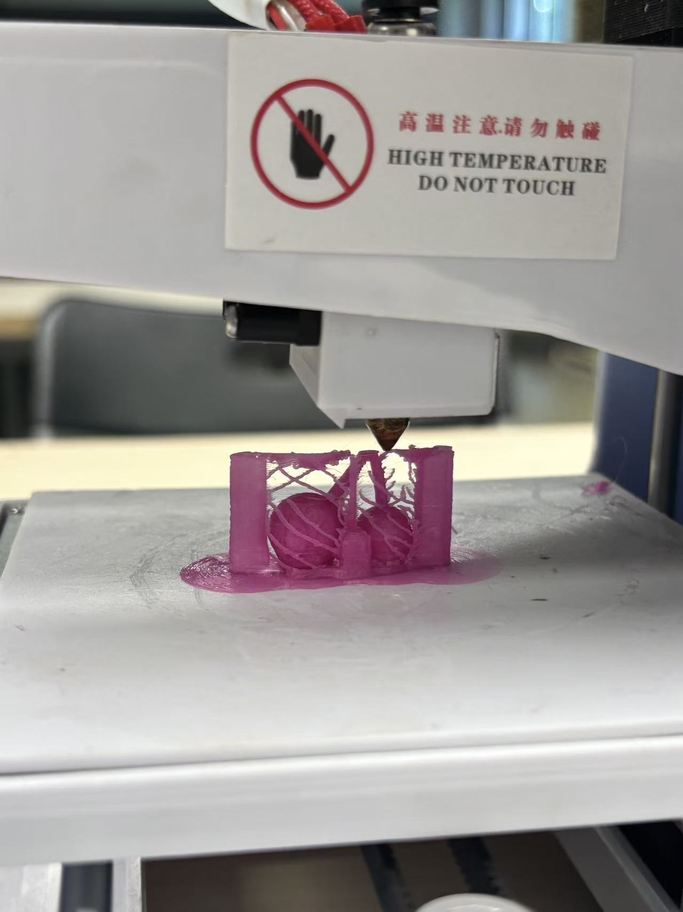

# 3D scanning and 3D printing

## 1
This was my first attempt at using RealityScan to create a 3D scan of an object. The mobile app determines the position and shape of the object by continuously capturing photos. I scanned a small metal cherry. I took over 200 photos while circling around this tiny object. After loading for more than ten minutes, the app generated a 3D model, but I noticed some issues. The surface of the cherry was not smooth, the leaf part had some dents, and there was no bottom surface. Overall, the model turned out rather rough.

第一次尝试使用realityscan进行3D扫描物体，这款手机软件是根据连续拍摄照片来判断物体的位置和造型。我拍摄了一个金属小樱桃。我围绕着这个小物品疯狂进行拍照，拍了两百多张照片。加载了十几分钟后，生成了一个3D模型，但发现了一些问题。樱桃表面并不光滑，叶子部分有凹陷，并且没有底面，这个模型比较粗糙。

Scanned object

Scanning process

Scanned model

## 2
I think perhaps improving photography skills can enhance the accuracy of the model. When taking photos around an object, the object should be centered in the viewfinder, and only part of the object should not be visible, as this can severely impact the scanning accuracy.I came across some posts on Xiaohongshu where some users use more professional equipment to take photos, even shooting in a studio. The models they scan turn out to be noticeably more accurate and refined.

我觉得或许提升拍照的技术，可以提高模型的精度。围绕物体进行拍照时，物体应在取景框中间，不能只出现部分物体，这样会严重影响扫描的准确度。我有刷到一些小红书的帖子，有些网友会使用更加专业的设备来拍摄照片，甚至是在摄影棚里进行拍摄。他们扫描出来的模型明显会更加准确且精美。
## 3
In class, I used a 3D printer for the first time on my own. Our group initially printed a very simple small cylinder, only 2 cm tall, so the printing was quite fast and finished within a few minutes. 

在课上我第一次自己使用3D打印机进行打印，我们小组最开始打印了一个很简单的小圆柱体，它的高度只有2厘米，所以打印得比较快，几分钟就打印完毕了。

## 4
When working on my individual assignment, the object I printed was the metal cherry pendant I had scanned earlier. At first, I chose to reproduce the original size at a 1:1 scale and used pink plastic to print a small model about 3 cm tall.

在完成个人作业时，打印的对象是之前扫描的金属樱桃挂件。最开始我选择了一比一还原原本物体的大小，使用粉色的塑料打印出了高约3厘米的一个小模型。

Printing process

## 5
However, when I removed the supports, one side of the cherry stem broke because the supports were too firmly attached to the main body. I tried gluing the two parts back together, but the result was not very good.

但在我拆除支撑的过程中，一侧的樱桃枝干断裂了，因为支撑与本体直接粘得太牢固了。我尝试用胶水把两部分拼合在一起，但效果一般。

## 6
For the second print, I adjusted the size of the object, enlarging the 3D model to about 5 cm tall. This time, the outcome was better—the details were clearer, and the main body was not damaged when I removed the supports. Still, the supports were very difficult to take off! 

第二次打印，我选择调整物体的大小，将3D模型调大至高约5厘米。这次打印的效果比之前好，细节能更清楚地被打印出来，并且这次在拆除支撑的过程中没有损坏本体。但支撑真的非常难拆除！

Final product

## 7
During the printing process, my classmates and I also noticed some common issues. For example, after the printer finishes making an object, it is important to clean the nozzle of leftover material; otherwise, clogging may cause printing failures in the next run.

和同学在打印过程中发现了一些共同的问题。比如，当3D打印机持续工作，打完一个物体应当清理出料口的废料，避免后续打印因为出料孔堵塞造成的打印失败。
## 8
During the 3D scanning and printing process, I learned about some relatively easy-to-use 3D scanning software and a few tips for using it. At the same time, I learned how to handle the files of scanned 3D models, including checking their cross-sections to determine whether they are suitable for printing. I also learned how to operate a household desktop 3D printer. 

在3D扫描和打印的过程中，我学习到了一些比较容易的3D扫描软件，以及它的一些使用小技巧。同时，我学习到了如何处理扫描好的3D模型的文件，学会查看它的切面来判断是否适合打印。我也学会了家用小型3D打印机的使用方法。
